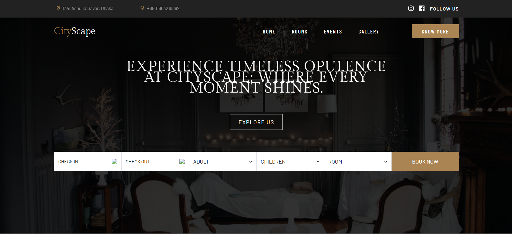

# CityScape



## Overview
CityScape is an HTML, CSS, and Tailwind-based front-end luxury website. The initiative for this front-end project is to design a luxury and elegant website that stands out in style. This project was undertaken as part of our Software III course, showcasing our ability to create visually appealing and high-quality web designs.

## Project Description
The main objective of CityScape is to present a website that exemplifies luxury and elegance. Utilizing modern web technologies like HTML, CSS, and Tailwind CSS, we aimed to create a user-friendly and visually stunning interface. Every element of the design has been carefully crafted to ensure a premium look and feel, suitable for high-end applications.

## Features
- **Responsive Design**: The website is fully responsive, ensuring a seamless experience across all devices.
- **Modern UI Components**: Using Tailwind CSS, we implemented modern UI components that enhance user interaction and satisfaction.
- **Elegant Typography**: Special attention has been given to typography to maintain the luxurious theme throughout the website.
- **High-Quality Images**: High-resolution images are used to further enhance the visual appeal of the website.

## Contributors
This project was contributed by:
- **Mehedi Hasan Hridoy**
- **Umme Salma Lamyea**

## Usage
To view and interact with the CityScape website, simply clone the repository and open the `index.html` file in your preferred web browser.

```sh
git clone https://github.com/mehedi-hridoy/CityScape-Software-Project-3.git

